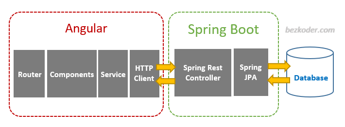

# Sistema de Información Parqueadero

## Descripción
Este proyecto es un sistema de información diseñado para administrar un parqueadero. Permite gestionar diferentes tipos de vehículos (automóviles, buses, motos) distribuidos en varios pisos, según la capacidad y la ocupación de cada uno. El sistema facilita tareas como la asignación de espacios, la gestión de tarifas y el registro de entrada y salida de vehículos.

---

## Características principales
- **Administrador:**
  - CRUD para la gestión de pisos del parqueadero.
  - Especificación y modificación de tarifas por tipo de vehículo.
- **Portero:**
  - Registro de entrada de vehículos y asignación de pisos según disponibilidad.
  - Bloqueo de acceso si el parqueadero está lleno.
- **Conductor:**
  - Visualización de tarifas y espacios disponibles por tipo de vehículo.

---

## Estructura del sistema

### Arquitectura general
El sistema está dividido en dos partes principales:

1. **Frontend:** Construido con Angular, que sigue una arquitectura basada en componentes, servicios y comunicación HTTP.
2. **Backend:** Desarrollado con Spring Boot, utilizando controladores REST y Spring JPA para la interacción con la base de datos.

La arquitectura sigue este flujo:
- El **frontend Angular** envía solicitudes HTTP (a través de un cliente HTTP) a los controladores REST en el backend.
- El **backend Spring Boot** procesa estas solicitudes, interactúa con la base de datos utilizando Spring JPA, y envía las respuestas de vuelta al frontend.

---

### Modelo lógico de la base de datos
El sistema utiliza las siguientes tablas principales:
- **Usuario:**
  - `ID`, `Username`, `Password`, `TipoUsuario` (Administrador, Portero, Conductor).
- **Piso:**
  - `ID`, `Numero`, `TipoVehiculo`, `Capacidad`, `EspaciosDisponibles`, `TarifaID` (relación con la tabla Tarifa).
- **Vehículo:**
  - `ID`, `Placa`, `TipoVehiculo`, `FechaEntrada`, `FechaSalida`, `PisoID` (relación con la tabla Piso).
- **Tarifa:**
  - `ID`, `TipoVehiculo`, `CostoPorMinuto`.
- **Pago:**
  - `ID`, `VehiculoID`, `TiempoInicio`, `TiempoFin`, `Costo`.

#### Relaciones
- La tabla `Piso` tiene una relación uno a uno con la tabla `Tarifa`.
- La tabla `Vehículo` tiene una relación uno a uno con la tabla `Piso`.
- La tabla `Pago` tiene una relación uno a uno con la tabla `Vehículo`.

---

## Detalles del desarrollo

### Frontend
El frontend se desarrolló con **Angular**, utilizando:
- **Router:** Para la navegación entre páginas.
- **Componentes:** Para encapsular la lógica y la presentación.
- **Servicios:** Para la comunicación entre componentes y con el backend.
- **Cliente HTTP:** Para enviar y recibir datos desde el backend REST.

### Backend
El backend se desarrolló con **Spring Boot**, utilizando:
- **Controladores REST:** Para manejar solicitudes HTTP desde el frontend.
- **Spring JPA:** Para gestionar las interacciones con la base de datos.

---

### Métodos principales
- `GetMapping` y `PostMapping` para la manipulación de datos y la navegación entre pestañas.
- Puerto de ejecución del backend: `8080`.

---

## Mockups
Puedes consultar los mockups del sistema en Figma:
[Mockups en Figma](https://www.figma.com/file/MtSrO2v9d2n3Nj1MMySSnK/Untitled?type=design&node-id=0%3A1&mode=design&t=8Qe1wcUOqfQ13VTs-1)

